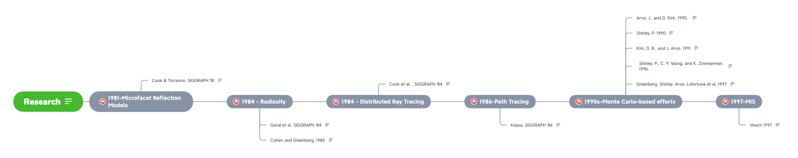

# A Brief History of Physically Based Rendering

> [PBR Book, Chapter 1: Introduction](http://www.pbr-book.org/3ed-2018/Introduction/A_Brief_History_of_Physically_Based_Rendering.html)

## Research

1. 1981, Microfacet Reflection Models
    - [Cook, R. L., and K. E. Torrance. 1981. A reflectance model for computer graphics. Computer Graphics (SIGGRAPH ’81 Proceedings), 15, 307–16.](https://dl.acm.org/doi/10.1145/357290.357293)

1. 1984, Radiosity
    - [Goral, C. M., K. E. Torrance, D. P. Greenberg, and B. Battaile. Modeling the interaction of light between diffuse surfaces. In Proceedings of the 11th Annual Conference on Computer Graphics and Interactive Techniques (SIGGRAPH ’84), 213–22.](https://dl.acm.org/doi/10.1145/800031.808601)
    - [Cohen, M., and D. P.  Greenberg. The hemi-cube: a radiosity solution for complex environments. SIGGRAPH Computer Graphics 19 (3), 31–40.](https://dl.acm.org/doi/10.1145/325334.325171)

1. 1984, Distributed Ray Tracing
    - [Cook, R. L., T. Porter, and L. Carpenter. 1984. Distributed ray tracing. Computer Graphics (SIGGRAPH ’84 Proceedings), 18, 137–45.](https://dl.acm.org/doi/10.1145/800031.808590)

1. 1986, Path Tracing
    - [Kajiya, J. T. 1986. The rendering equation. In Computer Graphics (SIGGRAPH ’86 Proceedings), 20, 143–50.](https://dl.acm.org/doi/10.1145/15922.15902)

1. 1990s, Monte Carlo–Based Efforts
    - [Arvo, J., and D. Kirk. 1990. Particle transport and image synthesis. Computer Graphics (SIGGRAPH ’90 Proceedings) 24 (4), 63–66.](https://dl.acm.org/doi/10.1145/97879.97886)
    - [Shirley, P. 1990. Physically based lighting calculations for computer graphics. Ph.D. thesis, Department of Computer Science, University of Illinois, Urbana–Champaign.](https://dl.acm.org/doi/book/10.5555/124947)
    - [Kirk, D. B., and J. Arvo. 1991. Unbiased sampling techniques for image synthesis. Computer Graphics (SIGGRAPH ’91 Proceedings), Volume 25, 153–56.](https://dl.acm.org/doi/10.1145/122718.122735)
    - [Shirley, P., C. Y. Wang, and K. Zimmerman. 1996. Monte Carlo techniques for direct lighting calculations. ACM Transactions on Graphics 15 (1), 1–36.](https://dl.acm.org/doi/10.1145/226150.226151)
    - [Greenberg, D. P., K. E. Torrance, P. S. Shirley, J. R. Arvo, J. A. Ferwerda, S. Pattanaik, E. P. F. Lafortune, B. Walter, S.-C. Foo, and B. Trumbore. 1997. A framework for realistic image synthesis. In Proceedings of SIGGRAPH ’97, Computer Graphics Proceedings, Annual Conference Series, 477–94.](https://dl.acm.org/doi/10.1145/258734.258914)

1. 1997, Multiple Importance Sampling
    - [Veach, E. 1997. Robust Monte Carlo methods for light transport simulation. Ph.D. thesis, Stanford University.]()

## Production    

## SIGGRAPH Courses

- [SIGGRAPH 2010 Course: Physically-Based Shading Models in Film and Game Production](http://renderwonk.com/publications/s2010-shading-course/)
- [SIGGRAPH 2012 Course: Practical Physically Based Shading in Film and Game Production](http://blog.selfshadow.com/publications/s2012-shading-course/)
- [SIGGRAPH 2013 Course: Physically Based Shading in Theory and Practice](http://blog.selfshadow.com/publications/s2013-shading-course/)
- [SIGGRAPH 2014 Course: Physically Based Shading in Theory and Practice](https://blog.selfshadow.com/publications/s2014-shading-course/)
- [SIGGRAPH 2020 Course: Physically Based Shading in Theory and Practice](https://blog.selfshadow.com/publications/s2020-shading-course/)
